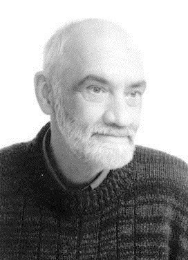

---

```{r setup, include=FALSE}
knitr::opts_chunk$set(echo = TRUE)
```

```{r include=FALSE}
if (!require(pacman)) {install.packages("pacman")
  library(pacman)}
pacman::p_load("readxl","summarytools","webr","ggplot2","curl","Hmisc",
               "sjmisc","car","lawstat","DiagrammeR","skimr",
               "tidyr","dplyr","broom","tidyverse")
```
<div class = "row">
  <div class = "col-md-6">

  </div>
  <div class = "col-md-6">
```
드세이저는 헤일리의 전략적 접근과 에릭슨(Erick- son)의 최면요법 개념에서 자신만의 단기치료 개념을 발전시켜 나갔는데, 이 같은 개념은 1975년에 『Family Process』이라는 학술지에 「단기치료: 두 사람의 조합」이라는 제목으로 발표하였다. 단기 가족치료'라는 명칭으로 시작된 그의 연구는 1982년부터 '해결중심 단기상담'이라는 공식적인 명칭을 갖게 되었다. 이후 그는 아내와 함께 1980년대 중반부터 미국뿐만 아니라 유럽, 아시아 등에서 수많은 초청 강연과 워크숍, 교육 과정 등을 수행해 나가다가 2005년 비엔나에서 사망하였다.
지난 20여 년 동안 오핸론(B. O'Hanlon), 크랄(R. Kral), 립칙(E. Lipchik), 밀러(S. Miller), 와이너데이비스(Weiner-Davis) 등의 임상가들이 단기 가족치료센터에서 훈련을 받았고, 이 모델 발전에 크게 기여해 왔다. 현재 해결중심상담은 학교, 병원, 상담, 자원봉사, 치료집단, 보호관찰, 사회사업팀 등 여러 분야에서 광범위하게 사용되고 있다. 또한 증상별로도 알코올중독, 범죄, 마약 중독, 스트레스 등 여러 증상에 효과적인 방법으로 활용된다.
```
  </div>
</div>